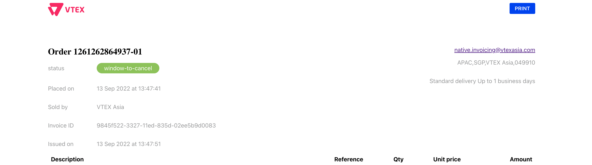
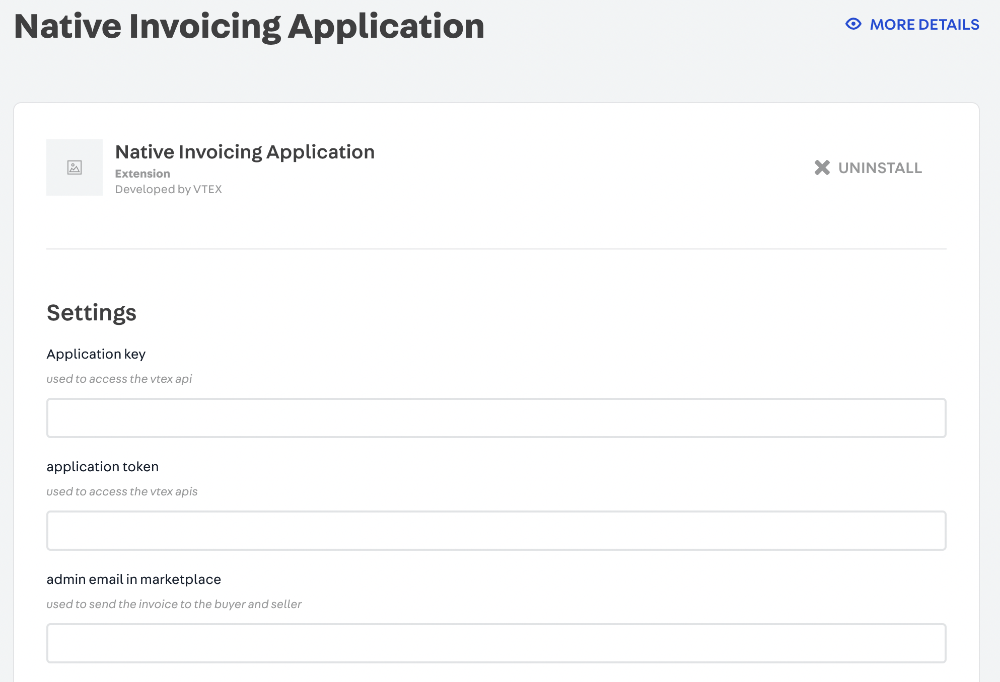

📢 Use this project, [contribute](https://github.com/vtex-apps/native-invoicing-app) to it or open issues to help evolve it using [Store Discussion](https://github.com/vtex-apps/store-discussion).

# Native Invoicing

The Native Invoicing app allows sellers to send out VAT-compliant invoices to their customers in a fast and easy way.



## Installation

Install `vtexasia.native-invoice-app` in your account.

    ```powershell
                    
                    vtex install vtexasia.native-invoicing-app@1.x  

    ``` 


## Configuration

Follow the instructions provided by the Native Invoicing App in the `Admin > Account Seetings > Apps > My Apps > native invoicing app`.



After the set up, you need to create a hook to listen the payment status. Make a cURL request to following endpoint.

<!-- https://${workspace}--{{account}}.myvtex.com/_v/orderhooks/create -->


curl --request POST \
 --url 'https://{accountName}.{environment}.com.br/api/orders/feed/config' \
 --header "Accept: application/json" \
 --header 'Content-Type: application/json' \
 --header 'X-VTEX-API-AppKey: ' \
 --header 'X-VTEX-API-AppToken: ' \
 --data '{
        "filter": {
          "type": "FromWorkflow",
          "status": ["invoiced"]
        },
        "queue": {
          "visibilityTimeoutInSeconds": 240,
          "messageRetentionPeriodInSeconds": 345600
        },
        "hook": {
          "url": "https://{workspace}--{accountName}.myvtex.com/_v/ordersWebhook",
          "headers": {
            "key": "value"
          }
        }
      }'

Replace accountName with your vtex account name, environment is `vtexcommercestable`,X-VTEX-API-AppKey and X-VTEX-API-AppToken with appkey and apptoken generated from your stores admin panel. In the hook configuration replace accountName with vtex account name and the 
workspace 

Production ENV: 
if we are using the app in production the workspace will be `master` or

Development ENV: 
The development workspace name where we have linked our app.


>ℹ️ **Note**
>${workspace} - current workspace in which you have installed the app.
>"master" for production


Also, install the `vtexasia.native-invoice-app-theme` , this works for the Native Invoicing app theme.

    ```powershell
                    
                    vtex install vtexasia.native-invoice-app-theme@0.x

    ``` 

## App functionality

There are three types of recipients who are sent invoices by the app: marketplace administrators, sellers, and buyers. The app will be trigger upon `Invoice sent` status.

| Receiver | Triggers |
| --- | --- |
| Marketplace admin | Receive all the invoice copies for the seller and buyer |
| Seller | Receive the invoice for sold products |
| Buyer | Receive the invoice for bought products |

### FYI
For unhelathy service issue while getting the data for invoice. We have created two cron schedulers for 2 endpoints using below CURL. If in future. Invoice app is installed in any other store or In whola if existing cron schedulers are expired. We can use this endpoint to create one.


curl --location 'http://whola.vtexcommercestable.com.br/api/scheduler/master/vtexasia.native-invoicing-app?version=4' \
--header 'VtexIdClientAutCookie: token' \
--header 'Content-Type: application/json' \
--header 'Cookie: janus_sid=8016b33c-e2c3-4547-a0af-3611e391ca58' \
--data '{
    "request": {
        "uri": "https://www.whola.com.au/_v/orders/buyer/200",
        "method": "GET",
        "headers": null
    },
    "scheduler": {
        "endDate": "2030-01-01T00:00:00+00:00",
        "expression": "* * * * *"
    }
}'

{
 "id": "1cc29e35-2d0c-43bb-b498-dc9cc5ed4f42",
 "workspace": "master",
 "app": "vtexasia.native-invoicing-app",
 "request": {
 "uri": "https://whola.myvtex.com/_v/orders/buyer/200",
 "method": "GET",
 "headers": null,
 "body": null
 },
 "retry": {
 "delay": {
 "addMinutes": 10,
 "addHours": 0,
 "addDays": 0
 },
 "times": 3,
 "backOffRate": 1.0
 },
 "attempt": 0,
 "endDate": "2030-01-01T00:00:00+00:00",
 "expression": "* * * * *",
 "NextExecution": "2023-10-12T07:12:00Z"
}

{
 "id": "80ca0491-7255-4136-a17a-e90ef11bebd3",
 "workspace": "master",
 "app": "vtexasia.native-invoicing-app",
 "request": {
 "uri": "https://www.whola.com.au/_v/orders/buyer/200",
 "method": "GET",
 "headers": null,
 "body": null
 },
 "retry": {
 "delay": {
 "addMinutes": 10,
 "addHours": 0,
 "addDays": 0
 },
 "times": 3,
 "backOffRate": 1.0
 },
 "attempt": 0,
 "endDate": "2030-01-01T00:00:00+00:00",
 "expression": "* * * * *",
 "NextExecution": "2023-10-12T08:10:00Z"
}
