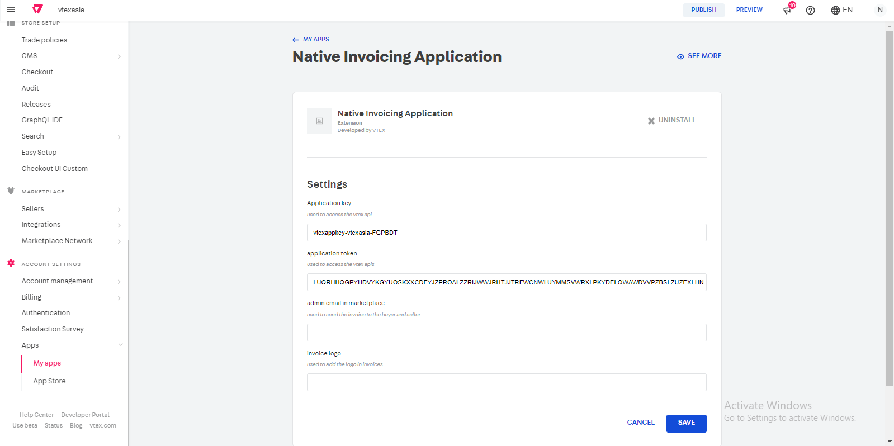

#Process

##Native invoicing APP :

####Step 1 :
- First install the app with
  - ``` vtex install vtexasia.native-invoicing-app-theme@1.0.2 ```

####Step 2 :

- Secondly configure AppKey, AppToken & marketplace admin email in admin.
  - `admin > account settings > apps > my apps`
  - search for native invoicing app and click on settings
  - Fill the details required
    


####Step 3:

- creating hook to listen the `payment-approved` status
- Make a GET request to following endpoint.
 
  - ```https://${workspace}--vtexasia.myvtex.com/_v/orderhooks/create```
  - ${workspace} - current workspace in which you have installed your app.
  - `` Note : "master" for production`` 

####Step 4:

- Now install Boilerplate app theme in the current workspace, By using below command.

    - ```vtex install vtexasia.native-invoice-app@0.0.2```
